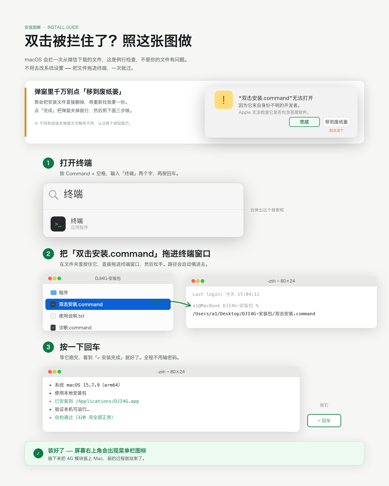
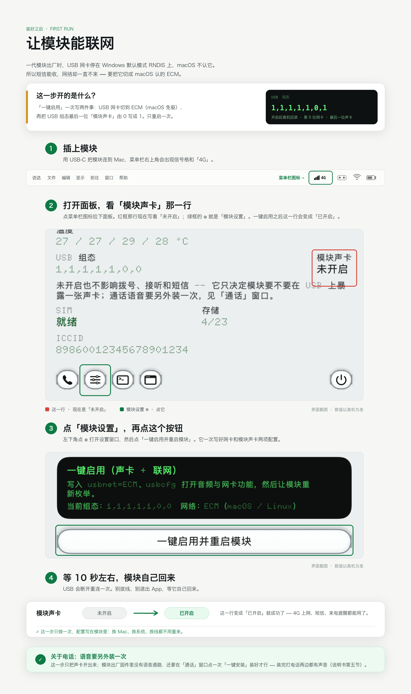

# 大疆 4G 模块 · Mac 端改装

让大疆一代 4G 模块（QDC507 / 移远 EG25-G）在 macOS 上**打电话、收发短信、4G 上网**。

插上 USB 就能用，一个菜单栏图标全搞定。

> 电话要先用一次「一键安装通话语音」：一代模块出厂时没有建立通话语音通路，
> 所以刚插上就拨号，两边都是没声音的。在「通话」窗口点一下那个按钮，
> 等模块重启半分钟回来，之后拨号、接听、通话、挂断全都正常，两个方向都有声音。
> 详情和真机实测数据见《客户说明》第五节。

---

## 装什么

在 Mac 的菜单栏里加一个工具，把模块变成 Mac 的：

| 功能 | 说明 |
| --- | --- |
| 来电提醒 | 有人打这个号码，屏幕上跳一张带铃声的卡片，可以接听、可以拒接 |
| 打电话 | 菜单栏直接拨号、接听、挂断；通话两个方向都有声音（先装一次通话语音） |
| 收短信 | 短信列表，中文正常，长短信自动拼接 |
| 发短信 | 支持中文，超长自动分段 |
| 4G 上网 | 模块变成 Mac 的一块网卡 |
| 看状态 | 信号、运营商、频段、流量用量 |

**只写模块的配置参数，不刷固件、不动硬件，随时可以改回原厂状态。**

---

## 有图的操作步骤

看不懂文字就直接看图，两步都画出来了：

**① 双击被拦住了怎么办**（macOS 的例行检查，跟文件本身没关系）



**② 怎么点「一键启用」**（一次开好 USB 网卡模式和模块声卡，截图里红框就是没开的样子）



---

## 怎么装

打开「终端」，粘贴这一行回车：

```bash
curl -fsSL https://github.com/zhangyuan-a11y/dji4g-mac/releases/latest/download/install.sh | bash
```

装完桌面会多出三个文件：一份完整说明书、一个一键诊断工具、一个卸载工具。

> 客户电脑不方便上网？下载 [DJI4G-安装包.zip](https://github.com/zhangyuan-a11y/dji4g-mac/releases/latest/download/DJI4G-installer.zip)
> （约 13 MB），解压后双击里面的「双击安装.command」，或者把它拖进终端窗口回车 —— 全程离线，不需要联网。

装好之后四步：

1. 把 SIM 卡插进模块的卡托（标准 nano-SIM）
2. 把模块插到 Mac 的 USB 口（尽量直插，别经过扩展坞）
3. 菜单栏图标 →「模块设置」→「一键启用并重启模块」（约 10 秒后模块回来）
4. 菜单栏图标 →「通话」→「一键安装通话语音」（约半分钟，模块会重启一次）
5. 点「体检」，它会告诉你还差什么

> 第 4 步只做一次。模块出厂时没有建立通话语音通路，补上之后拨号、接听、
> 通话、挂断两个方向都有声音；不做这一步，电话能拨通但两边听不见。

> 提示：启用 4G 上网时系统会要求输入开机密码 —— 因为要改「网络」设置，
> 这一步必须你本人授权。

---

## 环境要求

- macOS 13 或更新版本
- Intel 芯片和 Apple 芯片都能用（M1 / M2 / M3 / M4 已适配）
- 大疆一代 4G 模块

---

## 遇到问题

双击桌面上的「DJI4G-诊断.command」，它会在桌面生成一个报告压缩包。
把那个包发过来即可。

报告只包含机型、系统版本、USB 枚举、模块状态和运行日志，
**不包含短信内容、联系人、文件或任何账号信息**。

---

## 卸载

双击「卸载.command」。它会把 App 移到废纸篓（可恢复），
并可选地把模块恢复成出厂设置。

---

## 说明

这是第三方工具，与 DJI、移远没有官方关系。
它通过标准 AT 指令读写模块配置，不修改固件。
